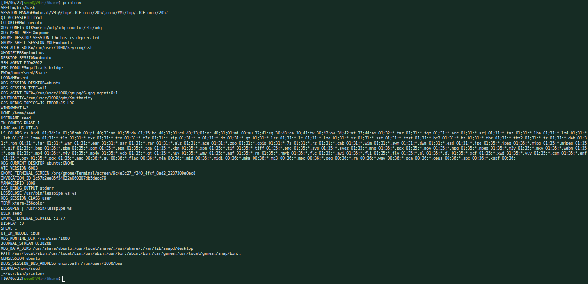
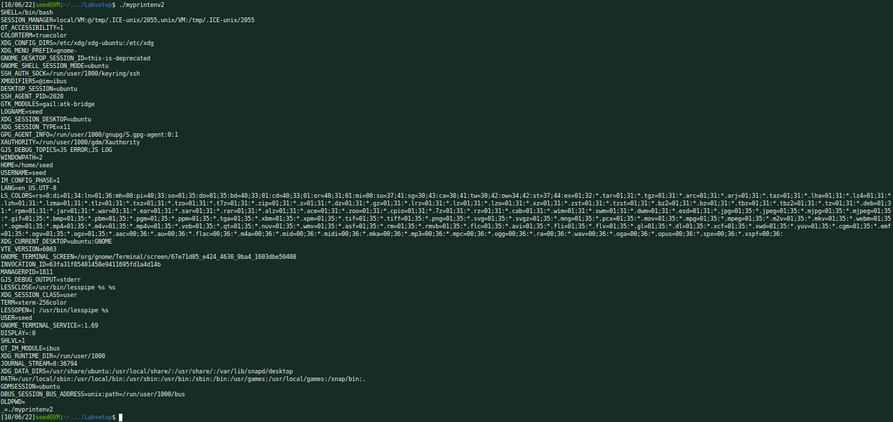

# Trabalho realizado na Semana #4

## Task 1: Manipulating Environment Variables

Using printev to print out environment variables:

Using printenv to print out PWD environment variable:

Using export on PWD environment variable (notice that the blue text changed):

And using unset to get it back to normal:

## Task 2

After compiling and running myprintenv.c, we get the following output:

By analizing this, we observe that the child process has some environment
variables set.

After moving the printenv() funciton to the parent part of the code, compiling
again and running gives us the following output:

We seem to get an output very similar to the previous. By using the diff
command to compare them we get (almost) no output, which comfirms that the
outputs are indeed (almost) the same:

Our conclusion is, that after using a fork(), the environment variables of the
child process become the same of its parent.
